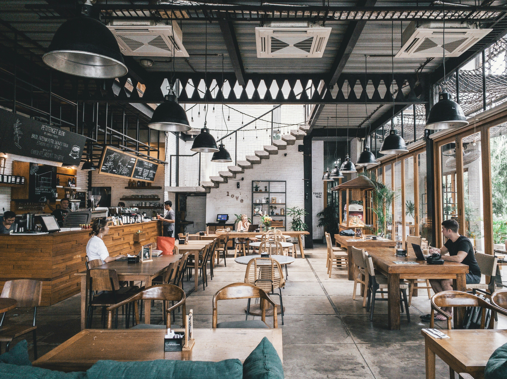
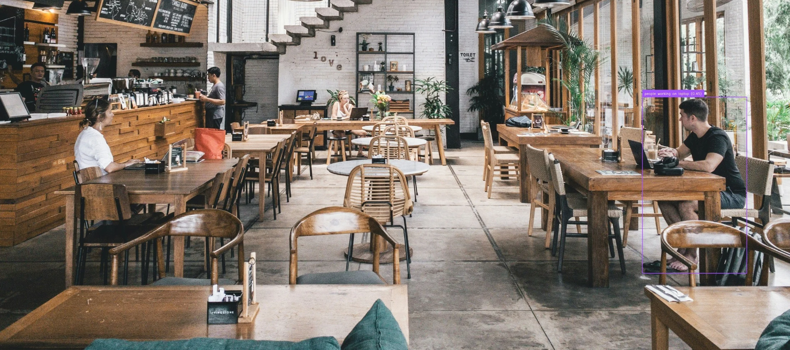
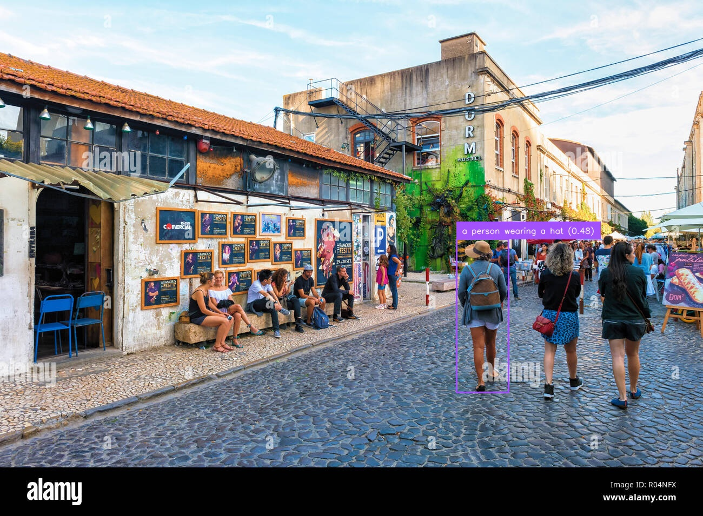
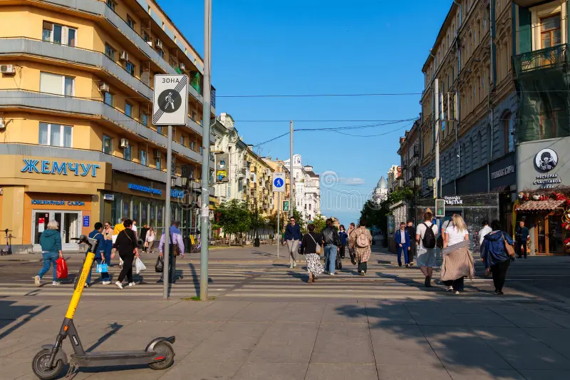
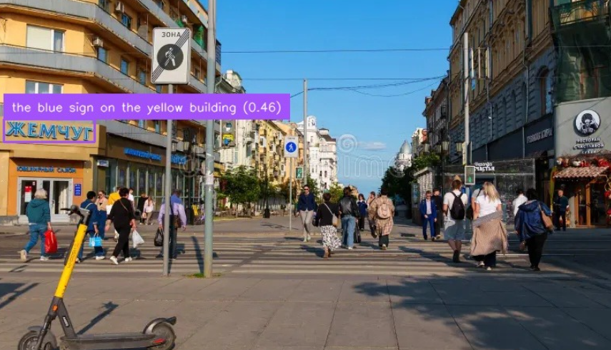
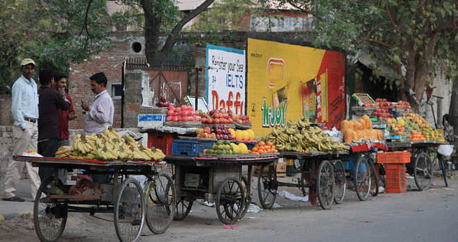
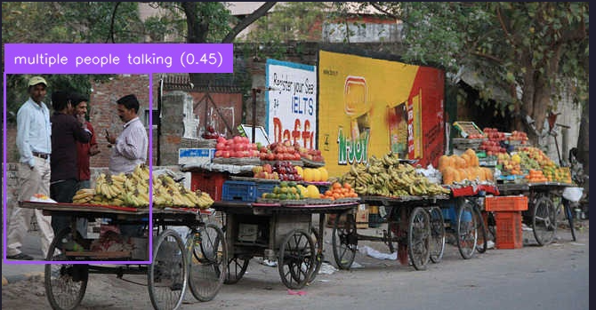

# Scene-Localization in Dense Images-via-Natural Language Queries
This project aims to build a system that can identify and localize specific sub-scenes  within a single dense image based on a natural language query describing one of the  events occurring in the scene. 

#Setup and Installation
Follow these steps to set up the environment and run the project.

# Step 1: Clone the Repository
First, clone this repository to your local machine:
* git clone https://github.com/prakhar14-op/Scene-Localization-in-Dense-Images-via-Natural-Language-Queries-
* cd Scene-Localization-in-Dense-Images-via-Natural-Language-Queries

# Step 2: Create Folders and Download Weights
1. Create a weights directory in the main project folder.
2. Download the model weights from this link:
     - https://drive.google.com/file/d/160I2AMxnQ_ZT_MOO4dBA6jPH6BwKXFeV/view?usp=sharing
     - and this file https://drive.google.com/file/d/1WMfdrdaiIPmRKIAx0i9q_NCIf7Xed2mC/view?usp=sharing
3. download these files and put them in a folder named "weights"

# Step 3: Set Up Python Environment
This project requires Python 3.9. It is highly recommended to use a virtual environment 
Create and activate the environment 
* py -3.9 -m venv venv on windows 
On Windows: .\venv\Scripts\activate

# Step 4: Install Dependencies
With the virtual environment activated, install all required packages.
* pip install -r requirements.txt
* pip install -e GroundingDINO/

Note: If you encounter build errors on Windows, you may need to install the Microsoft C++ Build Tools.

# How to Run
1. Make sure your virtual environment is activated.
2. Run the main script from your terminal:
      * python aims.py
3. The script will prompt you to enter the path to an image and your text query.
4. The results (an annotated image and a cropped image) will be saved in a new results folder.

example outputs 
## Dining Scene

## Market Scene

## Street Scene

## Street Vendor Scene

